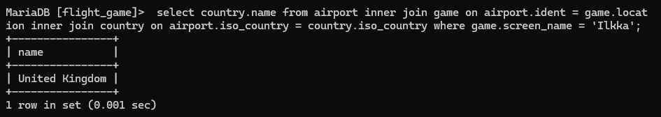

#Week 3 Excercise 3: Multiple Table Queries\
#Q1
select country.name as "country name", airport.name as "airport name" from country inner join airport on country.iso_country = airport.iso_country where airport.iso_country = 'IS';

#Q2
select name as "airport name" from airport where iso_country = 'FR' and type like '%large%';

#Q3
 select country.name as "country_name", airport.name as "airport_name" from country inner join airport on country.iso_country = airport.iso_country where country.continent = 'AN';

#Q4
select airport.elevation_ft from airport inner join game on airport.ident = game.location where game.screen_name = 'Heini';

#Q5
select airport.elevation_ft * 0.3048 as elevation_m from airport inner join game on airport.ident = game.location where game.screen_name = 'Heini';

#Q6
select airport.name from airport inner join game on airport.ident = game.location where game.screen_name = 'Ilkka';

#Q7
 select country.name from airport inner join game on airport.ident = game.location inner join country on airport.iso_country = country.iso_country where game.screen_name = 'Ilkka';

#Q8
select goal.name from game join goal_reached on game.id = goal_reached.game_id join goal on goal.id = goal_reached.goal_id where game.screen_name = 'Heini';

#Q9
select airport.name
    from game
    join goal_reached
    on game.id = goal_reached.game_id
    join goal
    on goal.id = goal_reached.goal_id
    join airport
    on game.location = airport.ident
    where game.screen_name = 'Ilkka' and goal.name = 'CLOUDS';

#Q10
select country.name from game join goal_reached on game.id = goal_reached.game_id join goal on goal.id = goal_reached.goal_id join airport on game.location = airport.ident join country on country.iso_country = airport.iso_country where game.screen_name = 'Ilkka' and goal.name = 'CLOUDS';

