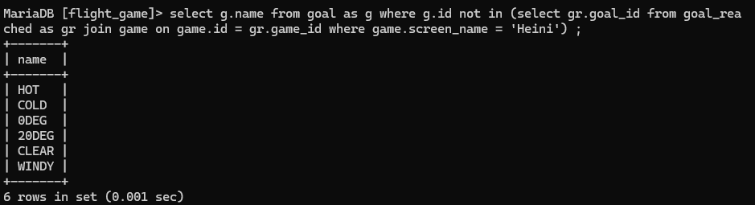

#Week 4 Exercises 4: Join

#Q1
 select country.name as "country name", airport.name as "airport name" from country join airport on country.iso_country = airport.iso_country where country.name = 'Finland';

#Q2
 select game.screen_name, airport.name from airport join game on game.location = airport.ident;

#Q3
select game.screen_name, country.name from airport join game on game.location = airport.ident join country on country.iso_country = airport.iso_country;

#Q4
select airport.name, game.screen_name from airport left join game on airport.ident = game.location where airport.name like "%Hels%";

#Q5
select goal.name, game.screen_name from goal left join goal_reached on goal_reached.goal_id = goal.id left join game on goal_reached.game_id = game.id;

#Exercises 5: Subqueries\
#Q1
select country.name from country join airport on country.iso_country = airport.iso_country where airport.name like "Satsuma%";

#Q2
select airport.name from airport join country on country.iso_country = airport.iso_country where country.name = 'Monaco';

#Q3
select game.screen_name from game join goal_reached on goal_reached.game_id = game.id join goal on goal.id = goal_reached.goal_id where goal.name = 'CLOUDS';

#Q4
select name from country where iso_country not in (select iso_country from airport);

#Q5
select g.name from goal as g where g.id not in (select gr.goal_id from goal_reached as gr join game on game.id = gr.game_id where game.screen_name = 'Heini') ;

