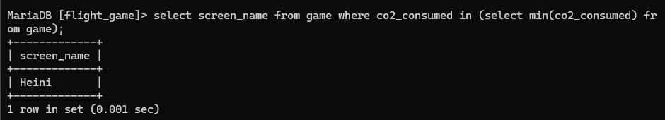
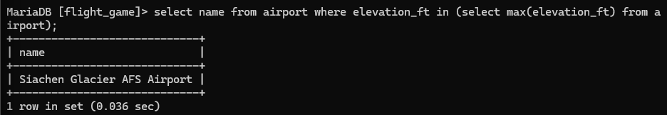

#Week 5 Exercises 6: Aggregate Queries\
#Q1
select max(elevation_ft) as "max(elevation_ft)" from airport;


#Q2
select continent, count(*) from airport group by continent;


#Q3
select g.screen_name, count(*) from game as g join goal_reached as gr on g.id = gr.game_id group by g.screen_name;


#Q4
select screen_name from game where co2_consumed in (select min(co2_consumed) from game);


#Q5
``select ct.name, count(*) from country as ct left join airport as ap on ct.iso_country = ap.iso_country group by ct.name order by count(*) DESC limit 50;``


#Q6
select screen_name from game where co2_consumed in (select min(co2_consumed) from game);


#Q7
 select name from airport where elevation_ft in (select max(elevation_ft) from airport);


#Q8
select ct.name from country as ct join airport on ct.iso_country = airport.iso_country where airport.elevation_ft in (select max(airport.elevation_ft) from airport);


#Q9
``select count(*) from goal_reached as gr join game as g on g.id = gr.game_id where g.screen_name ='Vesa';``


#Q10
select name from airport order by (0 - ABS(latitude_deg)) ASC limit 1;


#Exercises 7: Update Queries\
#Q1
```
update game
set  location = (select ident from airport where name = "Nottingham Airport"), co2_consumed = co2_consumed+500
where screen_name = "Vesa";

select * from game;
```


#Q3
```
delete from goal_reached;
select * from goal_reached;
```

#Q4
```
delete from game;
select * from game;
```


